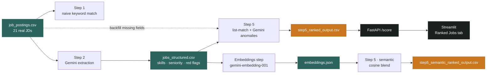
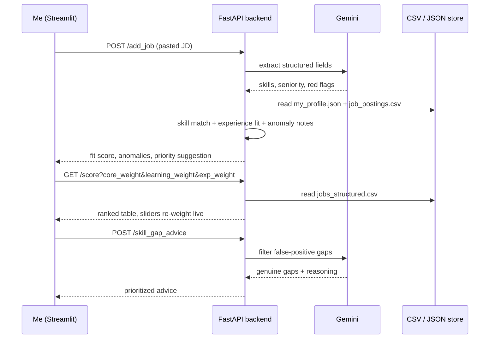

# A decision assistant for my own job search

*Engineering log · hackathon build, Jul 8–11, 2026*
*Job Search Decision Assistant · FastAPI + Streamlit + Gemini · MIT licensed*

I was 20 job postings deep into my search with no good way to tell which ones actually fit. So I built a tool to score them, flag the weird ones, and tell me if the search itself was working — and along the way, a GPU benchmark told me something I didn't expect.

## 1. The problem

I'm an ML/AI Engineer with three and a half years at Ascentt Systems, looking for the next GenAI/ML role. That means reading a lot of job descriptions — and every one takes real effort to evaluate honestly. Do I actually meet the bar, or am I pattern-matching on a few keywords? Is this posting vague because the role is early-stage, or because no one bothered to write it properly? And after weeks of applying, is any of it working, or am I just generating noise?

None of those are spreadsheet questions. They're judgment calls that a keyword filter can't make, and they get harder to make objectively about your own search the longer you're in it. So I built something to make those calls for me, using the actual text of the postings and my own profile as the reasoning inputs — not a rules engine, an LLM doing the reading I'd otherwise have to do by hand, at a scale I couldn't sustain manually.

## 2. What it actually does

The finished tool is a FastAPI backend behind a five-tab Streamlit dashboard. Each tab maps to one real decision I was making by hand:

| Tab | Feature | What it does |
|---|---|---|
| Ranked Jobs | **Fit scoring** | Every posting scored on skill match, in-progress-learning match, and experience fit, with the weighting exposed as live sliders instead of buried constants. |
| Ranked Jobs | **Anomaly flags** | Gemini reads each posting for vague requirements and red flags — the kind of thing you'd only catch by actually reading it, not by counting words. |
| Forecast | **Outcome trend** | Callback rate, response time, and an early-vs-recent trend across logged applications, so "is this working" has an answer instead of a feeling. |
| Ask | **Natural-language query** | Gemini turns a plain question into SQL against BigQuery — "which companies want 5+ years" without writing a query by hand. |
| Add Job | **Paste-and-score** | Paste a new JD in, get extraction and a fit score back immediately — no re-running the pipeline for one posting. |
| Ranked Jobs | **Filtered gap advice** | Raw keyword gaps get run back through Gemini to strip out false positives before I spend time worrying about them. |
| Interview Prep | **Prep brief** | A fit pitch, likely questions, and STAR-story mappings against my own project history, generated per job. |
| *(scoring)* | **Semantic similarity** | Real Gemini embeddings, cosine-compared against my profile — a second signal beyond keyword overlap. More on this below. |

## 3. The pipeline

Under the dashboard is a sequence of steps that turns raw job-posting text into a ranked, explainable score. I built it incrementally — a naive version first, then replaced the weak parts once I could see where they broke:

Step 1 was a throwaway prototype: does a profile skill string literally appear in the raw JD text, with a word-count rule to flag thin postings. It worked well enough to prove the shape of the idea and badly enough to make the next step obvious. Step 2 sends every posting to `gemini-2.5-flash` and gets back structured JSON — required skills, tech stack, seniority, requirements clarity, red flags — instead of a wall of text. Step 5 re-does the fit scoring against that clean structure, and gets its anomaly flags directly from Gemini's own reasoning instead of a word-count heuristic.

The one wrinkle I kept rather than hid: a Persistent Systems posting fails Gemini's JSON parse and stays in the dataset marked `error: could_not_parse`, with Step 5 falling back to the original CSV for its experience-year fields. A silently-dropped failure would have made the demo look cleaner and the pipeline look less honest.

## 4. The benchmark that changed the design

Before I settled on embeddings as the semantic-similarity signal, I ran an experiment that didn't go the way I expected — and I think the failure is more interesting than the feature it led to.

The premise was simple: job-posting text search should be a textbook GPU win, so I benchmarked `cudf.pandas` against plain pandas on 200,000 synthetic postings, scanning for 20 core skill keywords per row.

| Run | Workload | CPU (pandas) | GPU (cudf / cupy) | Result |
|---|---|---|---|---|
| v1 | 20× `str.contains()` keyword scan, 200k rows | 13–24s | 27–36s | CPU won |
| v2 | Same scan, combined into one regex + warm-up pass | 13–24s | still slower | CPU still won |
| **v3** | **Cosine similarity, 1M × 384-dim vectors** | **8.4s** | **0.20s** | **GPU won, 41×** |

String search lost on the GPU even after I collapsed 20 kernel launches into one and excluded CUDA warm-up cost from the timing — it wasn't measurement noise, string operations just don't parallelize the way dense linear algebra does. Vector similarity, on the other hand, is exactly the workload a GPU is built for: one matrix multiply against a million rows dropped from 8.4 seconds to 0.2.

> The negative result was the useful one. It told me GPU acceleration wasn't going to help the part of the pipeline I'd already built — but it made a strong case for a part I hadn't built yet.

That's the direct line from a failed keyword-search benchmark to real Gemini embeddings in the product: `step_embeddings_generate.py` now embeds every posting and my profile at 3072 dimensions, and `step5_semantic_fit_score.py` blends the (min-max normalized) cosine similarity in as a fourth scoring term alongside skill match, learning match, and experience fit.

## 5. How a request becomes a score

End to end, here's what happens between me pasting a job description in and getting a ranked, explained score back out:

## 6. What's live versus what's on the slide

Hackathon architecture diagrams tend to describe the system you're pitching, not always the one that's running. I'd rather say plainly which parts of mine are the same thing:

- **Live** — Fit scoring, anomaly flags, add-job, skill-gap advice, interview prep: all five run today through FastAPI + Streamlit, purely on local CSV/JSON, no GCP credentials required.
- **Live, standalone** — Semantic (embedding) fit scoring: real, working, and produces a ranked CSV, but it's a script I run manually, not something the live `/score` endpoint calls yet.
- **Manual step** — BigQuery loading for `/ask`: done once by hand through the BigQuery console, not a script in the repo, and `project_id` is still a placeholder pending my own GCP project.
- **Not deployed** — Cloud Run: Dockerfile and start script are written for it and I could ship today, but I chose not to attach a billing account for a hackathon build.
- **Colab only** — GPU acceleration (`cudf.pandas` / `cupy`): lives entirely in the benchmark notebooks that produced the finding above; the shipped backend runs on plain pandas.

None of that is a confession so much as a map: the reasoning layer — the part that actually reads postings and makes judgment calls — is the part that's real and running. The infrastructure around it is exactly as far along as a four-day build should be.

## 7. What I'd do differently next

Two things stood out while building this that I'd fix first if I kept going: the fit-score and skill-parsing helpers are copy-pasted across the backend and several scripts instead of shared, which already bit me once — the learning-skill term silently scored zero across every job until I noticed the profile's skill list didn't match what postings actually asked for. And the semantic scoring belongs in the live endpoint, not a side script; the 41× benchmark result is only worth something if the product I use every day actually benefits from it.

---
*Job Search Decision Assistant · FastAPI · Streamlit · Gemini 2.5 Flash · gemini-embedding-001 · MIT License*
